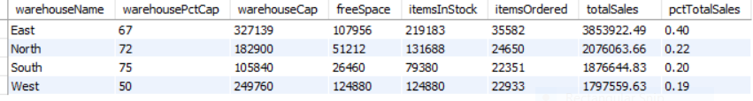

# Mint-Classics-Inventory-Analysis

## Overview
In this project as an entry-level data analyst at the fictional Mint Classics Company, I am tasked with analyzing data in a relational database with the goal of supporting inventory-related business decisions that lead to the closure of a storage facility.

## Project Scenario
Mint Classics Company, a retailer of classic model cars and other vehicles, is considering closing one of its storage facilities. 

To support a data-based business decision, they are looking for suggestions and recommendations for reorganizing or reducing inventory while maintaining timely service to their customers. For example, they would like to be able to ship a product to a customer within 24 hours of the order being placed.

As a data analyst, I have been asked to use MySQL Workbench to familiarize myself with the general business by examining the current data. I received a data model and sample data tables to review. I will then need to isolate and identify those parts of the data that could be useful in deciding how to reduce inventory.

## Project Objectives

1. Explore products currently in inventory.

2. Determine important factors that may influence inventory reorganization/reduction.

3. Provide analytic insights and data-driven recommendations.

## My Challenge

My challenge will be to conduct an exploratory data analysis to investigate any patterns or themes that may influence the reduction or reorganization of inventory in the Mint Classics storage facilities. To do this, I will import the database and then analyze the data. I will also pose questions, and seek to answer them meaningfully using SQL queries to retrieve data from the database provided.

## Database

Database SQL creation script provided and can be seen [here](https://github.com/Ash021980/Mint-Classics-Inventory-Analysis/blob/main/Kk6HcEYrS-23P-RaCeFG2Q_8cc95a70f07644cc9cba5af99ad5b1f1_mintclassicsDB.sql).

### EER(Extended Entity-Relationship) diagram

## Conclusions

<b>1. Where are products stored?</b> 

The South warehouse appears to be the best candidate for closing.  
- Least amount of total inventory(79,380)
- Smallest capacity available(75% full)
- Least total storage capacity(105,840)
- Filled the least number of orders(22,351)
- Only accounts for 20% of total sales.
There is more than enough space at the West 
warehouse, which is running at half capacity, with room for @120k items.  The
North and East warehouses have 28% and 33% available space as well. 
<b>SQL Query</b> 
<pre>
WITH wareprod_tbl  AS
(SELECT
    w.warehouseCode,
    w.warehouseName,
    w.warehousePctCap,
    p.itemsInStock,
    p.productCnt,
    p.productLineCnt
FROM
    warehouses w
        INNER JOIN
    (SELECT 
        warehouseCode,
        SUM(quantityinStock) AS itemsInStock,
        COUNT(productCode) AS productCnt,
        COUNT(DISTINCT productLine) AS productLineCnt
    FROM
        products
    GROUP BY warehouseCode) AS p ON p.warehouseCode = w.warehouseCode
ORDER BY p.itemsInStock),
wrkord_tbl AS
(SELECT
    warehouseCode,
    warehouseName,
    warehousePctCap,
    SUM(quantityOrdered) AS itemsOrdered,
    SUM(lineTotal) AS totalSales
FROM
    (SELECT 
        o.orderNumber,
            o.productCode,
            p.warehouseCode,
            w.warehouseName,
            w.warehousePctCap,
            o.quantityOrdered,
            o.priceEach,
            (o.quantityOrdered * o.priceEach) AS lineTotal
    FROM
        orderdetails o
    LEFT JOIN products p ON o.productCode = p.productCode
    LEFT JOIN warehouses w ON p.warehouseCode = w.warehouseCode) AS wrk_table
GROUP BY warehouseCode, warehouseName, warehousePctCap)
SELECT
    wp.warehouseName,
    wp.warehousePctCap,
    ROUND((wp.itemsInStock / (wp.warehousePctCap / 100)), 0) AS warehouseCap,
    (ROUND((wp.itemsInStock / (wp.warehousePctCap / 100)), 0) - wp.itemsInStock) AS freeSpace,
    wp.itemsInStock,
    wo.itemsOrdered,
    wo.totalSales,
    ROUND((wo.totalSales / 9604190.61), 2) AS pctTotalSales
FROM wareprod_tbl wp
        LEFT JOIN
	 wrkord_tbl wo ON wp.warehouseCode = wo.warehouseCode
ORDER BY wo.totalSales DESC;
</pre>
<b>Results<b/> 

